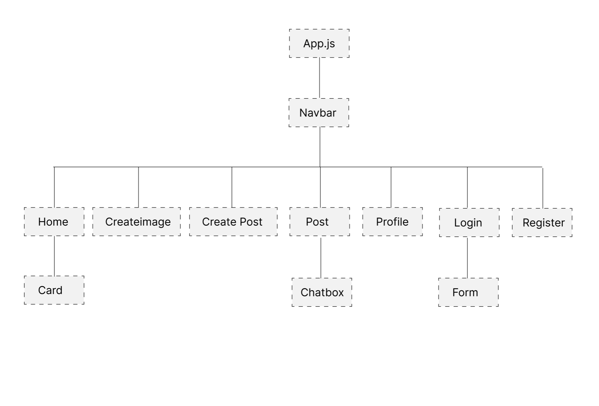
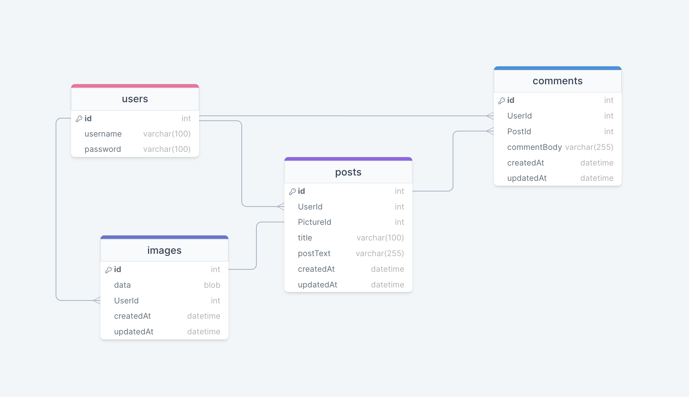

# Development for Fullstack App (CosmosVision)


As part of the General Assembly Software Engineering Immersive (SEI) course, developers work on creating a capstone project for a sprint of two weeks. Using a range of frontend development tools and technologies, including HTML, CSS, JavaScript, React, Tailwind, Node.js, Express, and MYSQL for the backend.

Cosmo Vision is a web application that harnesses the power of AI to create stunning user images based on individual prompts. With this platform, users can store their images in personal accounts, post them to the Discover page, and engage with other members by commenting on their posts. The primary objective of Cosmo Vision is to provide digital artists with the tool for creating stunning designs with ease. Ultimately, the app aims to empower these artists to train the AI bots themselves, enabling them to earn compensation whenever users engage with their trained bots. While Cosmo Vision is currently in the demo stage, users can explore and test the platform.

## Table of Contents

- [Development for Fullstack App (CosmosVision)](#development-for-fullstack-app-cosmosvision)
  - [Table of Contents](#table-of-contents)
  - [Installation](#installation)
  - [Usage](#usage)
  - [Technologies](#technologies)
  - [Hierarchy](#hierarchy)
  - [Frontend Approach](#frontend-approach)
    - [_Tailwind \& DaisyUI_](#tailwind--daisyui)
    - [_formik \& yup_](#formik--yup)
  - [Retrieved Base64_json image from database](#retrieved-base64_json-image-from-database)
- [Database and Server (ERD)](#database-and-server-erd)
  - [Connections (Openai)](#connections-openai)
  - [Endpoints](#endpoints)
  - [JWT authentication middleware to protect endpoints](#jwt-authentication-middleware-to-protect-endpoints)
  - [Image File Handling on Server Side](#image-file-handling-on-server-side)
  - [Challenges](#challenges)
  - [Unsolved Problems \& Further Work](#unsolved-problems--further-work)

## Installation

1. Clone the repository: git clone https://github.com/TylerWong92/finalproject.git
2. Install Client dependencies:

- npm install
- npm i axios
- npm i buffer
- npm i formik
- npm i yup
- npm i daisyui
- npm i react -router-dom
- npm i react-router-dom
- npm install -D tailwindcss

3. Start the development server: npm start
4. Open http://localhost:3000 or any other port that you have configured to view it in the browser.

5. Install Server dependencies:

- npm install
- npm init -y
- npm nodemon
- npm express
- npm cors mysql2
- npm install cors
- npm install bcrypt
- npm install jsonwebtoken

6. Start the development server: npm start
7. Open http://localhost:3001 or any other port that you have configured to view it in the browser.

## Usage

This repository should run concurrently with the backend server to retrieve data from the database and store user inputs in the database.

## Technologies

This project uses the following technologies:

- HTML, CSS, Javascript
- TailwindCSS: a utility-first CSS framework
- MySQL: a relational database management system used to store and retrieve data.
- Express: a backend web framework for Node.js
- React: a frontend JavaScript library for building user interfaces
- Node.js: a JavaScript runtime environment for server-side development

## Hierarchy



## Frontend Approach

### _Tailwind & DaisyUI_

Faster development: Tailwind and DaisyUI provide a set of pre-built, customizable UI components that can be used to quickly build web applications. By using these tools, developers can save time and effort in building UI components from scratch, and instead focus on the core functionality of the application.

### _formik & yup_

Formik simplifies form management by providing form data and handling form submission, while Yup offers efficient form validation with schema-based validation rules. Together, these tools can streamline the form development process and improve the user experience of your application.

## Retrieved Base64_json image from database

The binary data retrieved from the database needs to be read in order to display the images correctly in the browser.

1. For the components that will be rendering the images retrieved, we need to import `Buffer` which helps in the handling and operations of binary data.

```javascript
const { Buffer } = require("buffer");
```

2. We will initialize the buffer with the data by calling `Buffer.from()` and we read the data from the buffer with `("base64")`, specifying that it is of Base64 encoding. The returned string is stored into a variable.

```javascript
const buffer = Buffer.from(response3.data, "base64");
```

3. We then finally pass this variable to our `` tag as it's `src={buffer}` property to be rendered.

# Database and Server (ERD)



This ERD diagram includes four tables: images, posts, comments, and users.

The images table has columns for id, data (BLOB), UserId, createdAt, and updatedAt. The primary key is id.

The posts table has columns for id, UserId, PictureId, title, postText, createdAt, and updatedAt. The primary key is id. It also includes a foreign key constraint on PictureId, referencing the id column of the images table.

The comments table has columns for id, UserId, PostId, commentBody, createdAt, and updatedAt. The primary key is id. It includes foreign key constraints on both UserId and PostId, referencing the id column of the users and posts tables, respectively.

The users table has columns for id, username, and password. The primary key is id. It includes foreign key constraints on UserId for both the images and comments tables, as well as the posts table.

## Connections (Openai)

Openai API https://openai.com/blog/openai-api

Generation Image https://platform.openai.com/docs/api-reference/images/create

```javascript
const { Configuration, OpenAIApi } = require("openai");

const configuration = new Configuration({
  apiKey,
});
const openai = new OpenAIApi(configuration);

const predict = async function (req) {
  const response = await openai.createImage({
    prompt: req.body.prompt,
    n: 1,
    size: "512x512",
    response_format: "b64_json",
  });

  return response.data;
```

**.env**

```javascript
OPENAI_API= <YOUR API KEY>
```

## Endpoints

The following endpoints are available:

POST `/auth` Users registration route

POST `/auth/login` - Users login route check pass and provide accessToken

GET `/auth/valid` - Check if user has the valid token prevent fake token and return user information

GET `/auth//basicinfo/:id` - Return User information User ID and Username
</br>

POST `/image` - Call OPEN-AI API to generate image and returns "b64_json" image.

GET `/image/byuserId/:id` - Return all images from the user Id.

GET `/image/gallery/:id` - Return all images from the user that are not posted.

POST `/image/store` - Receive "b64_json" image into MySQL blob.

DELETE `/image/:id` - Delete image from database by PictureId.
</br>

GET `/posts` - retrieves all posts and displays the newest post first.

GET `/posts/byId/:id` - Return a single post using post id.

GET `posts/byuserId/:id` - Return all post belonging to user.

GET `posts/gallery/:id` - Return all post with image belonging to user.

POST `/posts/post` - Create post.

PUT `/posts/:id` - Update post title and description by post id.

DELETE `/posts/:postId` - Delete post from database by post id.
</br>

GET `/comments/:postId` - Return all comments belonging to this post id.

POST `/comments` - Create comments to a post id.
</br>

## JWT authentication middleware to protect endpoints

1. Created middleware function to protect endpoints.

```javascript
const { verify } = require("jsonwebtoken");

const validateToken = (req, res, next) => {
  const accessToken = req.header("accessToken");

  if (!accessToken) return res.json({ error: "User not logged in!" });

  try {
    const validToken = verify(accessToken, "importantsecret");
    //Store user name req.user pass it to endpoint
    req.user = validToken;
    if (validToken) {
      return next();
    }
  } catch (err) {
    return res.json({ error: err });
  }
};

module.exports = { validateToken };
```

2. Using useContext to provide routes that need access to validateToken

```javascript
router.delete("/:postId", validateToken, async (req, res) => {
  const postId = req.params.postId;
  await Posts.destroy({
    where: {
      id: postId,
    },
  });
  res.json("DELETED SUCCESSFULLY");
});
```

## Image File Handling on Server Side

To handle images sent from the client side, a base64 string representation of the image is sent to the `/image/store` endpoint. The image is retrieved via the `req.body` and used to create a Picture object

```javascript
router.post("/store", validateToken, async (req, res) => {
  try {
    const picture = await Picture.create({
      data: req.body.imageData,
      UserId: req.user.id,
    });
    // picture.UserId = req.user.id;
    res.json("successful");
  } catch (err) {
    console.error(err);
    res.status(500).json({ error: "Server error" });
  }
});
```

The Picture schema contains a `BLOB` data type field to handle the image. The Picture model uses `sequelize` ORM to perform insertion of the created object.

```javascript
const { INTEGER } = require("sequelize");

module.exports = (sequelize, DataTypes) => {
  const Picture = sequelize.define("Picture", {
    data: {
      type: DataTypes.BLOB("long"),
      allowNull: false,
    },
  });

  Picture.associate = (models) => {
    Picture.belongsTo(models.Users, {
      onDelete: "cascade",
    });
  };
  return Picture;
};
```

## Challenges

- **Fronted Component**: Due to time constraints, there are no shared reusable components, and components are built onto individual pages.
  <br>

- **Backend Data inconsistency**: inconsistency of naming endpoints to be improve for a more readable way can be challenging and can lead to confusion. Better planning is necessary for querying data that is needed for the frontend, as different data structures may cause multiple workarounds to query the same dataset."

## Unsolved Problems & Further Work

- Create multiple OpenAI API call that allows individual digital artists to integrate their APIs into my app. This will enable users to click on generated artwork and select a digital artist, triggering a call to their API.
